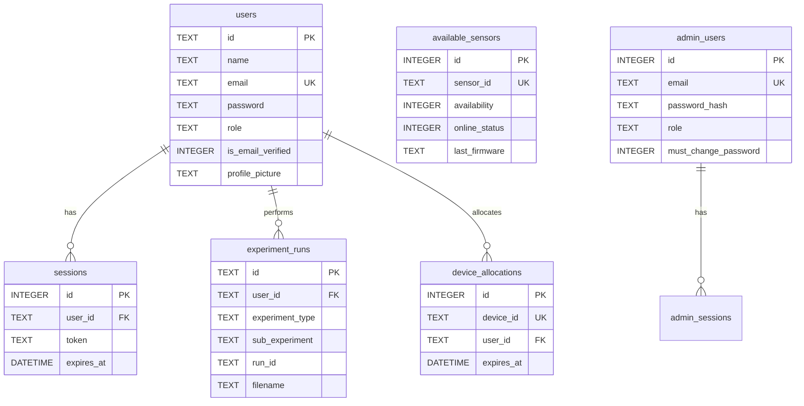
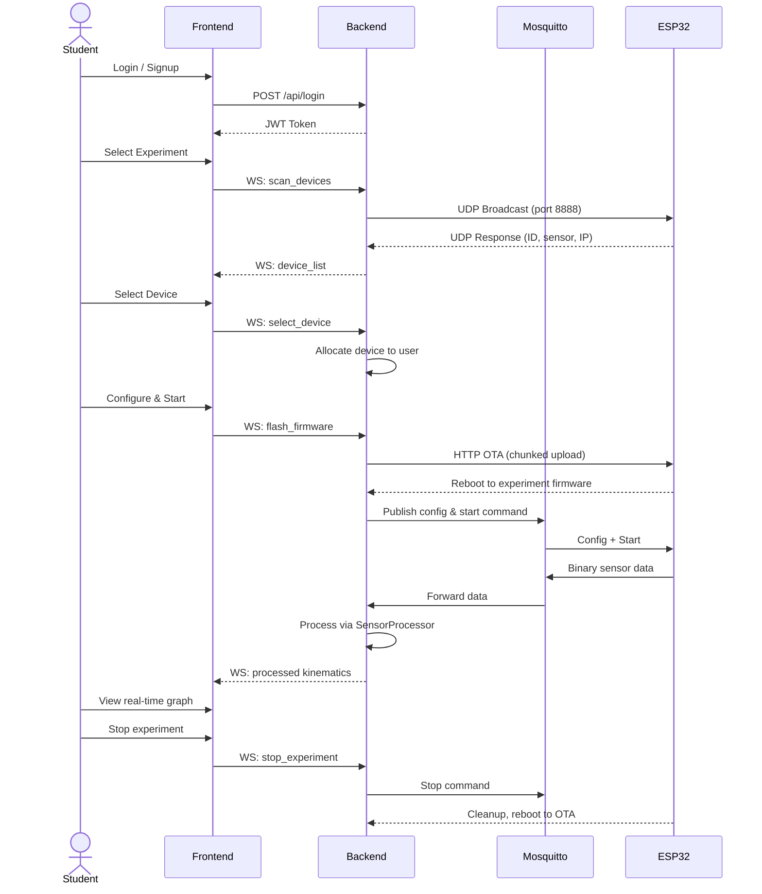

<p align="center">
  <h1 align="center">🔬 LabExpert</h1>
  <p align="center">
    <em>An IoT-powered laboratory experiment platform for physics education</em>
  </p>
  <p align="center">
    
    
    
    
    
    
    
  </p>
</p>

---

## 📖 Overview

**LabExpert** is a full-stack IoT platform that connects **ESP32 sensor modules** to a **React web application** through a **Python backend**, enabling real-time physics experiments in educational labs. Students and educators can select experiments, wirelessly connect to sensor hardware, collect live data, and visualize results — all from a browser.

### ✨ Key Features

- 🔬 **5 Experiment Categories** — Distance, Oscillation, Temperature, Light Intensity, and AI-powered Motion Analysis
- 📡 **Real-Time Data Streaming** — MQTT-based sensor data with binary packet optimization
- 📊 **Live Graphing** — Interactive Plotly.js charts with multi-axis visualization
- 🔄 **Over-the-Air Updates** — Dual-partition OTA firmware deployment to ESP32 modules
- 📲 **BLE Provisioning** — Zero-config WiFi setup for sensor modules via Bluetooth
- 🔍 **UDP Auto-Discovery** — Automatic detection of sensor modules on the local network
- 👥 **Multi-User Support** — Per-device session management with conflict prevention
- 🛡️ **Admin Dashboard** — User management, device monitoring, and system control
- 📱 **PWA Support** — Installable as a native-like app on mobile and desktop
- 🌙 **Dark Mode** — Full dark theme support across the application

---

## 🏗️ Architecture

```
┌────────────────────────────────────────────────────────────────────────┐
│                          React Frontend (PWA)                         │
│         Vite 6 · React 19 · TailwindCSS · Plotly.js · Zustand         │
│                                                                        │
│  ┌──────────┐ ┌──────────────┐ ┌───────────┐ ┌──────────────────────┐ │
│  │  Auth &   │ │   User       │ │ Experiment│ │  Admin Dashboard     │ │
│  │  Signup   │ │  Dashboard   │ │ Interface │ │  & Management        │ │
│  └──────────┘ └──────────────┘ └───────────┘ └──────────────────────┘ │
│        │              │              │                │                │
│        └──────────────┴──────────────┴────────────────┘                │
│                       WebSocket + REST API                             │
└───────────────────────────────┬────────────────────────────────────────┘
                                │
                                ▼
┌────────────────────────────────────────────────────────────────────────┐
│                      Python Backend (FastAPI)                          │
│          Uvicorn · SQLAlchemy · paho-mqtt · Mosquitto Broker           │
│                                                                        │
│  ┌─────────────┐ ┌────────────┐ ┌────────────┐ ┌───────────────────┐ │
│  │  Session &   │ │   MQTT     │ │    OTA     │ │  Sensor Processor │ │
│  │  Device Mgr  │ │  Service   │ │  Manager   │ │    Pipeline       │ │
│  └─────────────┘ └────────────┘ └────────────┘ └───────────────────┘ │
│  ┌─────────────┐ ┌────────────┐ ┌────────────┐ ┌───────────────────┐ │
│  │  User Auth   │ │    UDP     │ │    BLE     │ │  WebSocket Client │ │
│  │  & Admin     │ │  Discovery │ │  Service   │ │    Manager        │ │
│  └─────────────┘ └────────────┘ └────────────┘ └───────────────────┘ │
└───────────────────────────────┬────────────────────────────────────────┘
                                │
            ┌───────────────────┼───────────────────┐
            │ MQTT (1883)       │ UDP (8888/8889)    │ HTTP OTA
            ▼                   ▼                    ▼
┌────────────────────────────────────────────────────────────────────────┐
│                        ESP32 Sensor Modules                            │
│                                                                        │
│  ┌─────────────────────┐      ┌───────────────────────────────────┐   │
│  │  OTA Bootloader     │      │  Experiment Firmware               │   │
│  │  (Partition ota_0)  │ ───► │  (Partition ota_1)                 │   │
│  │  • BLE Provisioning │      │  • TOF / Ultrasonic / Oscillation  │   │
│  │  • UDP Discovery    │      │  • Temperature / Light             │   │
│  │  • OTA Web Server   │      │  • MQTT Data Publishing            │   │
│  └─────────────────────┘      └───────────────────────────────────┘   │
└────────────────────────────────────────────────────────────────────────┘
```

---

## 📁 Repository Structure

```
LabEx_V1.2/
│
├── my-app/                              # 🖥️ React Frontend (PWA)
│   ├── src/
│   │   ├── App.jsx                      #    Root app with routing
│   │   ├── pages/
│   │   │   ├── UserDashboard.jsx        #    Main user dashboard
│   │   │   ├── AdminDashboard.jsx       #    Admin control panel
│   │   │   ├── ExperimentInterface.jsx  #    Universal experiment UI
│   │   │   ├── SensorProvisioning.jsx   #    BLE sensor setup wizard
│   │   │   ├── ProgramSensor.jsx        #    Firmware programming UI
│   │   │   └── About.jsx               #    About page
│   │   ├── components/
│   │   │   ├── Login.jsx / Signup.jsx   #    Authentication forms
│   │   │   ├── ForgotPassword.jsx       #    Password recovery (OTP)
│   │   │   ├── PlotlyGraph.jsx          #    Real-time graph engine
│   │   │   ├── OSIInterface.jsx         #    Oscillation-specific UI
│   │   │   ├── DeviceScanner.jsx        #    Device discovery UI
│   │   │   ├── Header.jsx / Navbar.jsx  #    Navigation components
│   │   │   └── common/                  #    Shared UI components
│   │   ├── experiments/
│   │   │   ├── experimentConfig.js      #    Experiment definitions (9 types)
│   │   │   └── experimentRegistry.js    #    Plugin system for experiments
│   │   ├── hooks/
│   │   │   ├── useWebSocket.js          #    WebSocket connection hook
│   │   │   └── usePerformance.js        #    Performance monitoring
│   │   ├── stores/
│   │   │   ├── authStore.js             #    Auth state (Zustand)
│   │   │   └── experimentStore.js       #    Experiment state (Zustand)
│   │   ├── context/
│   │   │   ├── ThemeContext.jsx          #    Dark/light mode
│   │   │   └── FullscreenContext.jsx    #    Fullscreen graph mode
│   │   ├── services/                    #    API service layer
│   │   ├── utils/                       #    API client, helpers
│   │   └── styles/                      #    CSS modules per page
│   ├── vite.config.js                   #    Vite + PWA config
│   ├── package.json
│   └── server.js                        #    Production Express server
│
├── py_backend/                          # ⚙️ Python Backend
│   ├── main.py                          #    FastAPI entry point (1761 lines)
│   ├── session_manager.py               #    Device registration & allocation
│   ├── ws_client.py                     #    WebSocket manager for frontend
│   ├── ota_manager.py                   #    Chunked OTA firmware delivery
│   ├── sensor_service.py                #    ESP32 HTTP communication layer
│   ├── services/
│   │   ├── mqtt_service.py              #    MQTT pub/sub + binary parsing
│   │   ├── udp_discovery_service.py     #    UDP broadcast device discovery
│   │   ├── ble_service.py               #    BLE WiFi provisioning
│   │   ├── user_service.py              #    User CRUD & authentication
│   │   ├── session_service.py           #    Token session management
│   │   ├── otp_service.py               #    OTP generation & verification
│   │   ├── file_service.py              #    File upload/download
│   │   ├── admin_auth_service.py        #    Admin JWT + CSRF security
│   │   ├── admin_user_service.py        #    Admin user management
│   │   └── oscillation_service.py       #    Oscillation data analysis
│   ├── processor/
│   │   ├── processor_manager.py         #    Processor factory & lifecycle
│   │   ├── sensor_base.py               #    Abstract base class
│   │   ├── sensor_displacement.py       #    TOF distance → kinematics
│   │   ├── sensor_oscillation.py        #    Period & frequency analysis
│   │   ├── sensor_disp_angle.py         #    Displacement + angle → energy
│   │   ├── sensor_galileo.py            #    Inclined plane analysis
│   │   ├── sensor_temperature.py        #    Temperature conversion
│   │   └── sensor_video_oscillation.py  #    AI vision oscillation
│   ├── config/
│   │   └── database.py                  #    SQLAlchemy + SQLite schema
│   ├── utils/
│   │   ├── config.py                    #    Paths & constants
│   │   ├── crypto.py                    #    Encryption utilities
│   │   ├── network_utils.py             #    IP/SSID detection
│   │   └── packet.py                    #    Binary packet codec
│   ├── firmware/
│   │   ├── firmware_registry.json       #    Firmware name → file mapping
│   │   └── *.bin                        #    Compiled ESP32 binaries
│   ├── mosquitto.conf                   #    MQTT broker configuration
│   └── requirements.txt                 #    Python dependencies
│
├── LabExpert_Sensor_ESP32_CODES/         # 🔌 ESP32 Firmware (separate repo)
│   ├── ESP_32_OTA/                      #    OTA bootloader
│   ├── THR_Firmware_bin_Generator/      #    Temperature firmware
│   ├── TOF_Firmware_bin_Generator/      #    Time-of-Flight firmware
│   ├── OSI_Firmware_bin_Generator/      #    Oscillation firmware
│   ├── UltraSonic_Firmware_bin_Generator/ # Ultrasonic firmware
│   ├── shared/                          #    Shared ESP32 libraries
│   └── README.md                        #    Detailed firmware documentation
│
├── docs/                                # 📚 Documentation
│   ├── admin-auth-api.md                #    Admin API reference
│   └── admin-auth-schema.md             #    Admin database schema
│
├── requirements.txt                     # 📦 Root Python dependencies
└── .gitignore
```

---

## 🧪 Supported Experiments

| # | Experiment | Sub-Experiments | Sensor | Data Output |
|:-:|:-----------|:---------------|:-------|:------------|
| **1** | 📏 **Distance Measurement** | Free Fall, Modern Galileo | VL53L1X TOF / HC-SR04 | Distance, Velocity, Acceleration |
| **2** | 🔄 **Oscillation Counter** | Simple Pendulum, Compound Pendulum | LDR/Laser Gate | Period, Frequency, T² vs L |
| **3** | 🌡️ **Temperature Monitoring** | Live Temperature | DS18B20 | °C, °F, K vs Time |
| **4** | 💡 **Light Intensity** | Intensity Monitor | BH1750 | Lux vs Time |
| **5** | 🏃 **Motion Analysis (AI)** | Simple Pendulum, Galileo Experiment | Camera (Vision) | Angle, Distance, Velocity |

### Experiment Configuration System

Each experiment is defined declaratively in `experimentConfig.js`:

```javascript
{
  id: '1.1',
  name: 'Free Fall Experiment',
  firmware: 'TOFFFE.bin',
  dataFields: ['time', 'distance', 'velocity', 'acceleration'],
  graphConfig: { xAxis: 'time', yAxes: ['distance', 'velocity', 'acceleration'] },
  tableConfig: { columns: [...] },
  sensorOptions: [
    { type: 'TOF', label: 'TOF Sensor', firmware: 'TOFFFE.bin' },
    { type: 'ULT', label: 'ULT Sensor', firmware: 'ULTFFE.bin' }
  ],
  defaultConfig: { frequency_hz: 20, duration_s: 10 }
}
```

> Adding a new experiment only requires editing the config file — **no UI code changes needed**.

---

## 🔌 Communication Protocols

### Data Flow

```
ESP32 Sensor                Backend                    Frontend
    │                          │                          │
    │── MQTT Binary Data ─────►│                          │
    │   (timestamp, distance,  │── Process via ──────────►│
    │    sample#)               │   SensorProcessor       │
    │                          │                          │
    │                          │── WebSocket JSON ───────►│
    │                          │   (processed kinematics) │
    │                          │                          │
    │◄── MQTT Commands ───────│◄── WebSocket Commands ──│
    │   (start/stop/config)    │   (scan/select/config)   │
    │                          │                          │
    │◄── UDP Discovery ───────│                          │
    │   (broadcast @ 8888)     │                          │
    │── UDP Response ─────────►│                          │
    │   (device_id, sensor,    │                          │
    │    IP, MAC @ 8889)       │                          │
```

### MQTT Topics

| Topic Pattern | Direction | Purpose |
|:-------------|:----------|:--------|
| `labexpert/{device_id}/data` | ESP32 → Backend | Sensor data (binary packed) |
| `labexpert/{device_id}/data/binary` | ESP32 → Backend | Binary sensor packets |
| `labexpert/{device_id}/status` | ESP32 → Backend | Device status updates |
| `labexpert/{device_id}/config` | Backend → ESP32 | Experiment configuration |
| `labexpert/{device_id}/command` | Backend → ESP32 | Start/Stop/Pause/Resume |
| `labexpert/{device_id}/disconnect` | Backend → ESP32 | Cleanup & reboot to OTA |

---

## 💾 Database Schema

SQLite database with 11 tables managed via SQLAlchemy:



---

## 🔐 Security Features

| Feature | Implementation |
|:--------|:---------------|
| **User Authentication** | JWT tokens, bcrypt password hashing |
| **Email Verification** | OTP via email (yagmail) |
| **Admin Auth** | Separate JWT with CSRF protection |
| **Password Security** | Complexity validation, history tracking (last 5) |
| **Rate Limiting** | 5 login attempts per 5 minutes per IP |
| **Session Management** | Auto-expiry, inactivity timeout (30 min admin) |
| **CORS** | Dynamic origin validation for local network |

---

## 🛠️ Prerequisites

| Tool | Version | Purpose |
|:-----|:--------|:--------|
| [Python](https://python.org) | 3.10+ | Backend runtime |
| [Node.js](https://nodejs.org) | 18+ | Frontend build |
| [Mosquitto](https://mosquitto.org) | 2.0+ | MQTT broker |
| [PlatformIO](https://platformio.org/) | Latest | ESP32 firmware builds |
| [Git](https://git-scm.com/) | Latest | Version control |

---

## 🚀 Getting Started

### 1. Clone the Repository

```bash
git clone <repository-url>
cd LabEx_V1.2
```

### 2. Start the MQTT Broker

```bash
# Install Mosquitto, then:
mosquitto -c py_backend/mosquitto.conf
```

### 3. Set Up the Backend

```bash
cd py_backend

# Create virtual environment
python -m venv .venv

# Activate (Windows)
.venv\Scripts\activate

# Install dependencies
pip install -r requirements.txt

# Create .env file
cp .env.example .env  # Or create with required vars

# Start the backend
uvicorn main:app --host 0.0.0.0 --port 8000 --reload
```

The backend will:
- Initialize the SQLite database (`data/lab_expert.db`)
- Start the MQTT service (connects to Mosquitto)
- Start UDP discovery service (port 8888/8889)
- Seed default admin account (`labexpert.us@gmail.com`)

### 4. Set Up the Frontend

```bash
cd my-app

# Install dependencies
npm install

# Start development server
npm run dev
```

Access the application at **http://localhost:5173**

### 5. Production Build

```bash
cd my-app
npm run build        # Build to dist/
npm run start        # Serve via Express (port 3000)
```

---

## 🔄 User Workflow



---

## 🧠 Backend Service Architecture

| Service | File | Responsibility |
|:--------|:-----|:---------------|
| **SessionManager** | `session_manager.py` | Device registration, user↔device allocation, UDP discovery orchestration |
| **ClientWebSocketManager** | `ws_client.py` | Frontend WS connections, experiment lifecycle commands, BLE provisioning |
| **MQTTService** | `services/mqtt_service.py` | MQTT pub/sub, binary data parsing, device status forwarding |
| **UDPDiscoveryService** | `services/udp_discovery_service.py` | Periodic broadcast discovery, online device registry |
| **OTAManager** | `ota_manager.py` | Firmware selection, chunked HTTP upload to ESP32, progress tracking |
| **SensorProcessorManager** | `processor/processor_manager.py` | Factory for 6 sensor processors, per-device lifecycle |
| **UserService** | `services/user_service.py` | User CRUD, bcrypt auth, profile management |
| **AdminAuthService** | `services/admin_auth_service.py` | Admin JWT, CSRF tokens, rate limiting, password history |
| **OTPService** | `services/otp_service.py` | Email OTP generation, verification, expiry |
| **FileService** | `services/file_service.py` | Experiment data export (CSV, JSON), profile pictures |
| **BLEService** | `services/ble_service.py` | BLE scanning, WiFi credential provisioning via NimBLE |

### Sensor Processors

| Processor | Experiment | Input | Output |
|:----------|:-----------|:------|:-------|
| `DisplacementProcessor` | Free Fall / Distance | time, distance | velocity, acceleration, smoothed curves |
| `OscillationProcessor` | Simple/Compound Pendulum | cut times | period, frequency, T² vs L |
| `DispAngleProcessor` | Displacement + Angle | time, distance, angle | energy, forces |
| `GalileoProcessor` | Modern Galileo | time, distance | velocity, acceleration on incline |
| `TemperatureProcessor` | Temperature Monitor | raw temp | °C, °F, K conversions |
| `VideoOscillationProcessor` | AI Motion Analysis | video frames | angle, position tracking |

---

## 🌐 API Endpoints

### User Authentication

| Method | Endpoint | Description |
|:-------|:---------|:------------|
| `POST` | `/api/login` | User login (email + password) |
| `POST` | `/api/signup` | Create new account |
| `GET` | `/api/me` | Get current user profile |
| `PUT` | `/api/profile` | Update user profile |
| `POST` | `/api/forgot-password` | Send OTP to email |
| `POST` | `/api/verify-otp` | Verify OTP code |
| `POST` | `/api/reset-password` | Reset password with OTP |

### Admin API

| Method | Endpoint | Description |
|:-------|:---------|:------------|
| `POST` | `/api/admin/auth/login` | Admin login (sets HttpOnly cookie) |
| `GET` | `/api/admin/auth/me` | Admin profile |
| `POST` | `/api/admin/auth/change-password` | Change admin password |
| `POST` | `/api/admin/auth/logout` | Admin logout (clears cookies) |
| `GET` | `/api/admin/users` | List all admin users |
| `POST` | `/api/admin/users` | Create new admin |

### Device & Experiment

| Method | Endpoint | Description |
|:-------|:---------|:------------|
| `GET` | `/api/devices` | List available sensor devices |
| `POST` | `/api/devices/{id}/allocate` | Allocate device to user |
| `POST` | `/api/devices/{id}/release` | Release device |
| `POST` | `/api/experiment/configure` | Configure experiment parameters |
| `POST` | `/api/experiment/start` | Start data collection |
| `POST` | `/api/experiment/stop` | Stop data collection |
| `GET` | `/api/system/info` | System health & stats |

### WebSocket Events

| Event | Direction | Payload |
|:------|:----------|:--------|
| `scan_devices` | Client → Server | — |
| `device_list` | Server → Client | `{ devices: [...] }` |
| `select_device` | Client → Server | `{ device_id }` |
| `flash_firmware` | Client → Server | `{ device_id, experiment_type }` |
| `flash_progress` | Server → Client | `{ progress, message }` |
| `configure_experiment` | Client → Server | `{ config, experiment_type }` |
| `start_experiment` | Client → Server | `{ config }` |
| `sensor_data` | Server → Client | `{ time, distance, velocity, ... }` |
| `stop_experiment` | Client → Server | — |
| `ble_scan` | Client → Server | — |
| `ble_provision` | Client → Server | `{ ssid, password }` |

---

## 🖥️ Frontend Architecture

### Tech Stack

| Technology | Purpose |
|:-----------|:--------|
| **React 19** | UI components & hooks |
| **Vite 6** | Build tool & dev server |
| **TailwindCSS 3** | Utility-first styling |
| **Plotly.js** | Interactive scientific graphs |
| **Recharts** | Dashboard charts |
| **Zustand** | Lightweight state management |
| **React Router v7** | Client-side routing |
| **Axios** | HTTP client |
| **Lucide React** | Icon library |
| **react-qr-code** | QR code generation |
| **Vite PWA** | Progressive Web App support |

### Route Map

| Route | Component | Auth | Description |
|:------|:----------|:-----|:------------|
| `/login` | `Login` | Public | User login |
| `/signup` | `Signup` | Public | User registration |
| `/forgot-password` | `ForgotPassword` | Public | Password recovery (OTP) |
| `/about` | `About` | Public | About page |
| `/dashboard` | `UserDashboard` | Private | Main user dashboard |
| `/experiment/:id` | `ExperimentRouter` | Private | Dynamic experiment UI |
| `/sensor` | `SensorProvisioning` | Private | BLE sensor setup |
| `/sensor/program` | `ProgramSensor` | Private | Firmware programming |
| `/admin/login` | `AdminLogin` | Public | Admin authentication |
| `/admin/manage` | `AdminManage` | Admin | Admin management panel |

---

## 📡 ESP32 Firmware

The ESP32 firmware lives in `LabExpert_Sensor_ESP32_CODES/` — see its own [README.md](LabExpert_Sensor_ESP32_CODES/README.md) for comprehensive documentation covering:

- Dual-partition OTA bootloader architecture
- 5 firmware generators (THR, TOF, OSI, UltraSonic, BH1750)
- Shared libraries (LedController, NVS credentials)
- Complete GPIO pin mapping
- HTTP API endpoints
- Build & flash instructions

---

## 📦 Key Dependencies

### Backend (Python)

| Package | Version | Purpose |
|:--------|:--------|:--------|
| `fastapi` | 0.117.1 | Async web framework |
| `uvicorn` | 0.24.0 | ASGI server |
| `SQLAlchemy` | 2.0.23 | ORM & database |
| `paho-mqtt` | 2.1.0 | MQTT client |
| `bcrypt` | 4.0.1 | Password hashing |
| `pydantic` | 2.6.1 | Data validation |
| `numpy` / `scipy` | Latest | Scientific computation |
| `bleak` | 1.1.1 | BLE communication |
| `yagmail` | 0.15 | Email (OTP delivery) |
| `pyotp` | 2.8.0 | OTP generation |
| `websockets` | 15.0.1 | WebSocket support |
| `python-dotenv` | 1.0.0 | Environment config |
| `cryptography` | 46.0.3 | JWT token handling |
| `pillow` | 11.3.0 | Image processing |

### Frontend (Node.js)

| Package | Version | Purpose |
|:--------|:--------|:--------|
| `react` | 19.1.0 | UI framework |
| `vite` | 6.3.5 | Build tool |
| `plotly.js` | 3.2.0 | Scientific graphing |
| `recharts` | 3.2.1 | Dashboard charts |
| `zustand` | 5.0.8 | State management |
| `react-router-dom` | 7.6.2 | Routing |
| `axios` | 1.9.0 | HTTP client |
| `tailwindcss` | 3.4.1 | CSS framework |
| `vite-plugin-pwa` | 1.0.3 | PWA support |

---

## 🧪 Running Tests

```bash
# Backend tests
cd py_backend
python -m pytest tests/

# MQTT connectivity test
python test_mqtt.py

# UDP discovery verification
python verify_discovery.py
```

---

## 🤝 Contributing

1. **Fork** the repository
2. **Create** a feature branch: `git checkout -b feature/new-experiment`
3. **Follow** the modular architecture:
   - Backend: Add new processor in `processor/`, register in `processor_manager.py`
   - Frontend: Add experiment config in `experimentConfig.js` — UI auto-generates
   - Firmware: Follow the pattern in `LabExpert_Sensor_ESP32_CODES/`
4. **Test** all three layers (firmware → backend → frontend)
5. **Submit** a pull request

---

## 📄 License

This project is developed for educational purposes. See the root repository for license details.

---

<p align="center">
  <sub>Built with ❤️ for physics education — React · FastAPI · ESP32 · MQTT</sub>
</p>
